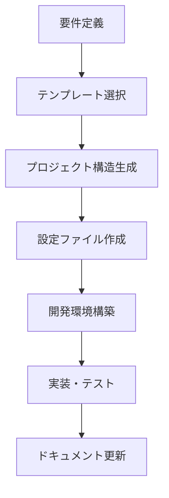

# AI Driven Dev Starter Kit への貢献

このガイドは、AI Driven Dev Starter Kit（AI駆動開発スターターキット）プロジェクトへの貢献方法を説明します。このプロジェクトは、AIエージェント（Claude、Cursor等）が効率的にプロジェクト開発を行えるよう、テンプレートとガイドラインを提供することを目的としています。

## 📂 プロジェクト構造

```
main/
├── CLAUDE.md                    # Claude Code用プロジェクトガイド
├── CONTRIBUTING.md              # このファイル
├── README.md                    # プロジェクト概要
├── docs/                        # プロジェクトドキュメント
│   ├── architecture/            # アーキテクチャ設計
│   ├── development/             # 開発ガイドライン
│   └── PROJECT_STRUCTURE.md     # プロジェクト構造説明
├── templates/                   # スケルトンテンプレート
│   ├── project-structures/      # プロジェクト構造テンプレート
│   ├── coding-agents/           # コーディングエージェント設定
│   ├── architectures/           # アーキテクチャテンプレート
│   ├── tools/                   # 開発ツールテンプレート
│   └── project-management/      # プロジェクト管理テンプレート
├── scripts/                     # 開発・運用スクリプト
│   ├── project-setup.ts         # プロジェクトセットアップ
│   └── scaffold-generator.ts    # スケルトン生成
└── config/                      # 設定ファイル
```

## 🎯 プロジェクトの目的

このスターターキットは以下の目的で設計されています：

1. **AIエージェント向け最適化**: Claude Code等のAIエージェントが理解しやすい構造
2. **テンプレート管理**: 様々なプロジェクトタイプのスケルトン提供
3. **開発効率化**: 標準化された開発プロセスとガイドライン
4. **品質保証**: 一貫したコード品質とアーキテクチャ

## 🤖 AIエージェント向けガイドライン

### プロジェクト理解のための重要ファイル

AIエージェントは以下のファイルを優先的に参照してください：

1. **`CLAUDE.md`** - プロジェクトの基本方針と開発ルール
2. **`docs/PROJECT_STRUCTURE.md`** - ディレクトリ構造の詳細説明
3. **`docs/architecture/ARCHITECTURE.md`** - システム設計原則
4. **`templates/`** - 各種テンプレート（プロジェクト構造、プロンプト等）

### 開発フロー



### テンプレート使用ガイド

#### 1. プロジェクト構造テンプレート
- **CLI (Rust)**: コマンドラインアプリケーション
- **Web (Next.js)**: フロントエンドWebアプリケーション
- **API (FastAPI)**: バックエンドAPIサービス

#### 2. コーディングエージェント設定
- Claude Code設定
- Cursor設定
- その他AIエージェント設定

#### 3. アーキテクチャテンプレート
- AWS Serverless
- その他クラウドアーキテクチャ

## 👥 人間の貢献者向け

### 前提条件

- Node.js 18+
- TypeScript
- Git

### セットアップ

```bash
# リポジトリクローン
git clone https://github.com/your-username/claude-code-dev-starter-kit.git
cd claude-code-dev-starter-kit/main

# 依存関係インストール
npm install

# スクリプトビルド
npm run build
```

### 開発ワークフロー

#### 1. テンプレート追加・更新

```bash
# 新しいプロジェクト構造テンプレート追加
mkdir templates/project-structures/new-template
# テンプレートファイル作成

# スクリプト更新
npm run build
npm test
```

#### 2. ドキュメント更新

```bash
# ドキュメント更新後
npm run lint
git add .
git commit -m "docs: Update template documentation"
```

#### 3. スクリプト開発

```bash
# TypeScriptコンパイル
npm run build

# テスト実行
npm test

# リンティング
npm run lint
```

### 貢献の種類

#### 1. テンプレート追加
- 新しいプロジェクト構造テンプレート
- 新しいアーキテクチャパターン
- 新しい開発ツール設定

#### 2. ドキュメント改善
- ガイドラインの明確化
- ベストプラクティスの追加
- トラブルシューティング情報

#### 3. スクリプト機能拡張
- プロジェクトセットアップ機能
- スケルトン生成機能
- バリデーション機能

#### 4. 品質向上
- エラーハンドリング改善
- パフォーマンス最適化
- セキュリティ強化

## 📝 コーディング規約

### TypeScript規約

```typescript
// 関数定義
export const generateProjectStructure = async (
  templateName: string,
  options: ProjectOptions
): Promise<void> => {
  // 実装
};

// インターフェース定義
interface ProjectOptions {
  name: string;
  description?: string;
  features: string[];
}

// エラーハンドリング
try {
  await processTemplate(templateName);
} catch (error) {
  logger.error('テンプレート処理に失敗しました', { error });
  throw new TemplateError(`${templateName} の処理に失敗しました`);
}
```

### ファイル命名規則

- **テンプレートファイル**: `kebab-case.md.template`
- **TypeScriptファイル**: `camelCase.ts`
- **設定ファイル**: `kebab-case.json`
- **ドキュメント**: `UPPER_CASE.md`

### コメント規約

```typescript
/**
 * プロジェクト構造を生成する
 * @param templateName - 使用するテンプレート名
 * @param options - プロジェクトオプション
 * @returns 生成されたプロジェクト構造
 */
export const generateStructure = async (
  templateName: string,
  options: ProjectOptions
): Promise<ProjectStructure> => {
  // 実装
};
```

## 🧪 テスト規約

### 単体テスト

```typescript
// テストファイル命名: *.test.ts
describe('TemplateProcessor', () => {
  describe('processTemplate', () => {
    it('should process valid template', async () => {
      // Arrange
      const template = 'cli-rust';
      const options = { name: 'test-project' };
      
      // Act
      const result = await processTemplate(template, options);
      
      // Assert
      expect(result).toBeDefined();
      expect(result.files).toHaveLength(5);
    });
  });
});
```

### 統合テスト

```typescript
describe('ScaffoldGenerator Integration', () => {
  it('should generate complete project structure', async () => {
    // テスト実装
  });
});
```

## 📚 ドキュメント規約

### マークダウン規約

```markdown
# セクションタイトル

## サブセクション

### コード例

```typescript
// コード例
```

### 重要事項

> **注意**: 重要な情報は引用ブロックで強調
```

### ドキュメント構造

1. **概要**: 機能の目的と概要
2. **使用方法**: 具体的な使用例
3. **設定**: 設定オプションの説明
4. **トラブルシューティング**: よくある問題と解決方法

## 🔄 Gitワークフロー

### ブランチ戦略

- **main**: 安定版
- **develop**: 開発版
- **feature/***: 機能開発
- **fix/***: バグ修正

### コミットメッセージ

```
feat(templates): Go用CLIテンプレートを追加
fix(scripts): テンプレートパス解決の不具合修正
docs: プロジェクト構造ドキュメントを更新
test: scaffold generatorの統合テスト追加
refactor: テンプレート処理ロジックを簡素化
```

### プルリクエスト

1. 機能ブランチからプルリクエスト作成
2. 変更内容の詳細説明
3. テスト結果の確認
4. レビュー依頼

## 🚨 禁止事項

### セキュリティ

- 機密情報のハードコーディング
- 不適切な権限設定
- 脆弱性のある依存関係

### コード品質

- 未使用コードの残存
- 適切でないエラーハンドリング
- パフォーマンスに影響する実装

### ドキュメント

- 古い情報の残存
- 不明確な説明
- 翻訳の不整合

## 🆘 サポート

### 問題報告

- GitHub Issuesで問題報告
- 再現手順の詳細記載
- 環境情報の提供

### 質問・相談

- GitHub Discussionsで質問
- プロジェクト固有のドキュメント参照
- コミュニティでの情報共有

## 📄 ライセンス

このプロジェクトはMITライセンスの下で提供されています。詳細は[LICENSE](LICENSE)を参照してください。

---

**注意**: このスターターキットを使用して作成される個別プロジェクトは、それぞれ独自のライセンス条件を持つ場合があります。