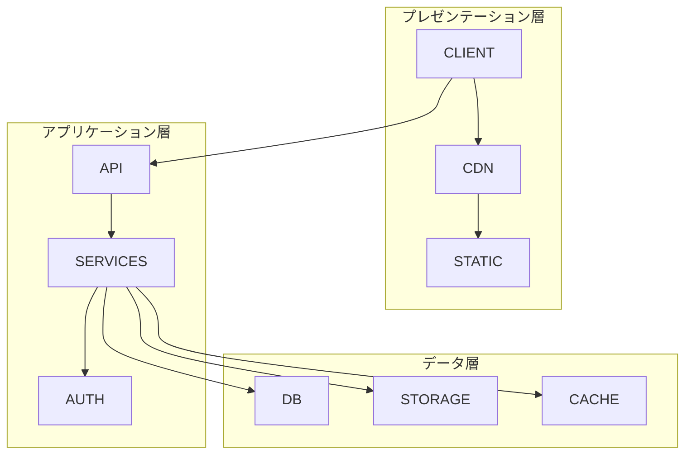
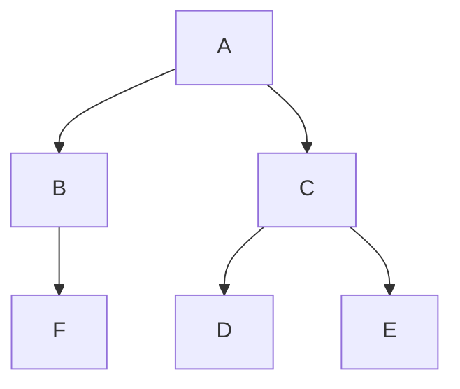
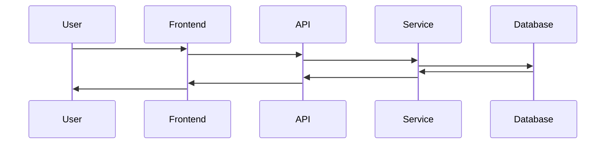
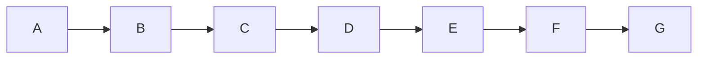

# システムアーキテクチャ

## 🏗️ 概要

wezterm-parallelは アーキテクチャを使用して構築されています。



## 🧠 設計哲学

### 基本原則

| 原則 | 説明 | 実装への影響 |
|------|------|-------------|
| **** |  |  |
| **** |  |  |
| **** |  |  |
| **** |  |  |

### アーキテクチャ決定

#### 1. 
**決定**: 

**根拠**:
- 
- 
- 

**トレードオフ**:
- : 
- : 

#### 2. 
**決定**: 

**根拠**:
- 
- 

## 📁 プロジェクト構造

### ディレクトリレイアウト

```
project-root/
├── packages/              # モノレポパッケージ
│   ├── frontend/         # フロントエンドアプリケーション
│   ├── backend/          # バックエンドサービス
│   └── shared/           # 共有ユーティリティ
├── infrastructure/       # インフラストラクチャ・アズ・コード
│   ├── lib/
│   │   └── stacks/      # インフラストラクチャスタック
│   └── test/            # インフラストラクチャテスト
├── docs/                # ドキュメント
└── scripts/             # ユーティリティスクリプト
```

### モジュール依存関係



## 🔄 データフロー

### 



### 


## 📊 データモデル

### データベーススキーマ

#### 
```typescript
interface  {
  id: string;
  // フィールドを追加
  createdAt: Date;
  updatedAt: Date;
}
```

#### 
```typescript
interface  {
  id: string;
  // フィールドを追加
  createdAt: Date;
  updatedAt: Date;
}
```

### APIモデル

```typescript
// リクエスト/レスポンスモデル
interface  {
  // 構造を定義
}

interface  {
  // 構造を定義
}
```

## 🔧 サービスアーキテクチャ

### サービス構成

```
services/
├── auth/              # 認証サービス
├── user/              # ユーザー管理
├── /        # 
├── /        # 
└── shared/            # 共有ユーティリティ
```

### サービス間通信

- **プロトコル**: 
- **フォーマット**: 
- **認証**: 

## 🚀 パフォーマンス考慮事項

### 最適化戦略

1. **キャッシュ**
   - 
   - 

2. **データベース最適化**
   - 
   - 

3. **ネットワーク最適化**
   - 
   - 

### スケーラビリティパターン

- **水平スケーリング**: 
- **ロードバランシング**: 
- **レート制限**: 

## 🔒 セキュリティアーキテクチャ

### セキュリティレイヤー

1. **ネットワークセキュリティ**
   - 
   - 

2. **アプリケーションセキュリティ**
   - 
   - 

3. **データセキュリティ**
   - 
   - 

### 認証と認可

```typescript
// Auth flow example
interface AuthFlow {
  authenticate: (credentials: Credentials) => Promise<Token>;
  authorize: (token: Token, resource: Resource) => Promise<boolean>;
  refresh: (refreshToken: string) => Promise<Token>;
}
```

## 📈 モニタリングとオブザーバビリティ

### メトリクス収集

- **アプリケーションメトリクス**: 
- **インフラストラクチャメトリクス**: 
- **ビジネスメトリクス**: 

### ロギング戦略

```typescript
// Logging levels and structure
enum LogLevel {
  DEBUG = 'debug',
  INFO = 'info',
  WARN = 'warn',
  ERROR = 'error',
}

interface LogEntry {
  timestamp: Date;
  level: LogLevel;
  message: string;
  context: Record<string, any>;
}
```

### アラートルール

| Alert | Condition | Severity | Action |
|-------|-----------|----------|--------|
|  |  | High/Medium/Low |  |
|  |  | High/Medium/Low |  |

## 🧪 テスト戦略

### テストレベル

1. **ユニットテスト**
   - Coverage target: %
   - Framework: 

2. **インテグレーションテスト**
   - Scope: 
   - Framework: 

3. **エンドツーエンドテスト**
   - Scenarios: 
   - Framework: 

### テスト構造

```typescript
// Example test structure
describe('', () => {
  describe('', () => {
    it('should ', () => {
      // Test implementation
    });
  });
});
```

## 🚢 デプロイアーキテクチャ

### 環境

- **Development**: 
- **Staging**: 
- **Production**: 

### デプロイパイプライン



### インフラストラクチャ・アズ・コード

- **Tool**: 
- **State Management**: 
- **Secret Management**: 

## 📚 関連ドキュメント

- **開発ガイド**: (../CONTRIBUTING.md)
- **APIドキュメント**: 
- **デプロイガイド**: 
- **セキュリティガイドライン**: 