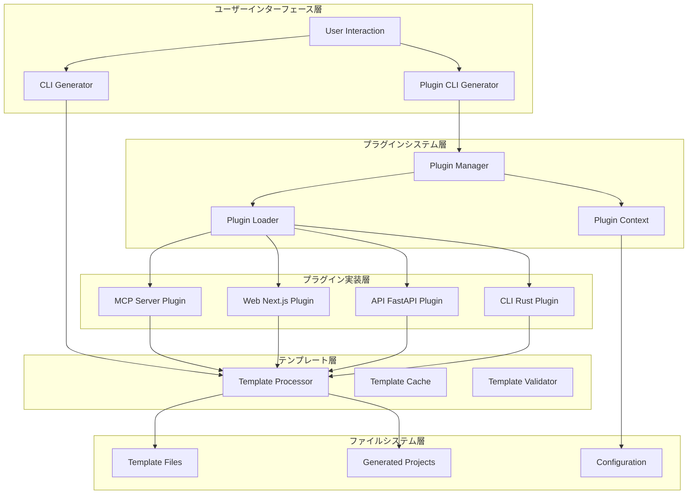
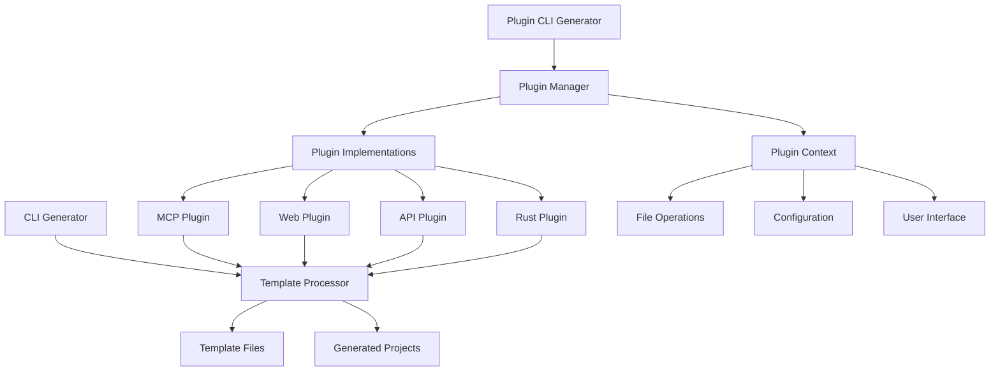
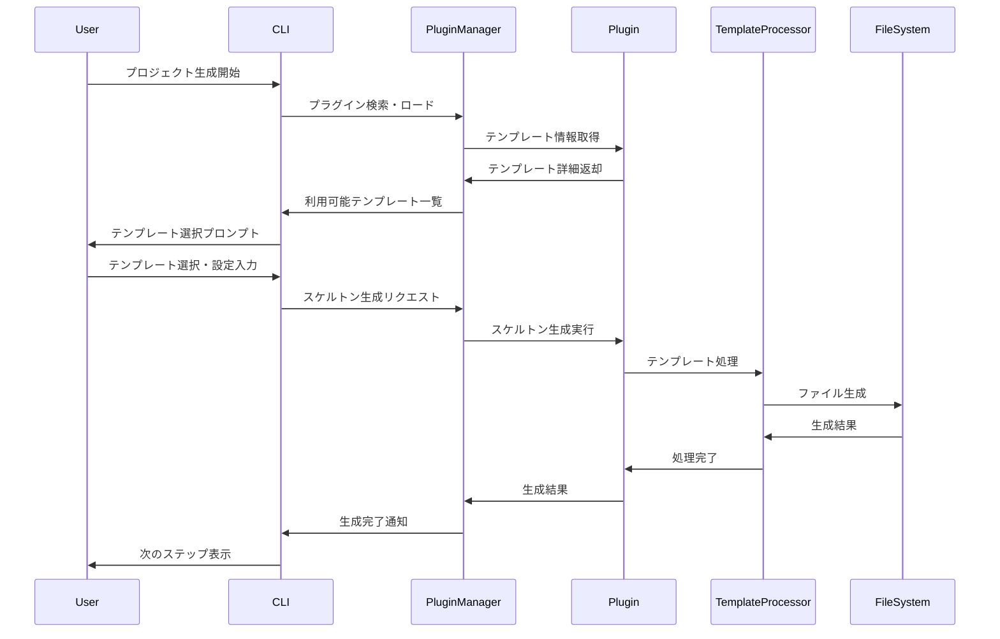
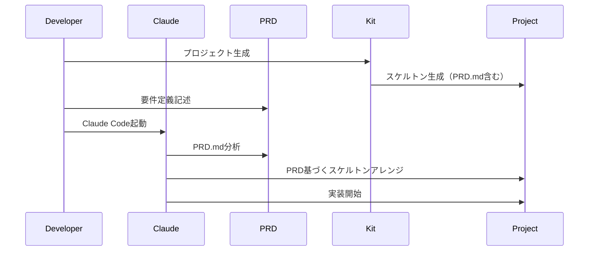
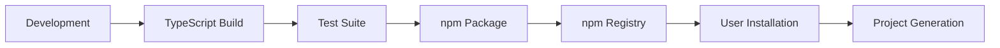

# AI Driven Dev Starter Kit - システムアーキテクチャ

## 🏗️ 概要

AI Driven Dev Starter Kit は、AI駆動開発プロジェクトのテンプレート管理とスケルトン生成を行うプラグインベースのツールキットです。



## 🧠 設計哲学

### 基本原則

| 原則 | 説明 | 実装への影響 |
|------|------|-------------|
| **プラグインベース** | すべてのテンプレートをプラグインとして独立実装 | 拡張性と保守性の向上 |
| **PRD駆動開発** | プロダクト要件定義を起点とした開発フロー | 要件に基づく構造化された開発 |
| **AI エージェント対応** | Claude Code などのAIエージェントとの協働 | AIによる自動化とアシスタンス |
| **テンプレート駆動** | 再利用可能なテンプレートベースの生成 | 一貫性と効率性の確保 |

### アーキテクチャ決定

#### 1. プラグインシステムの採用
**決定**: テンプレートをプラグインとして分離し、動的ロード可能なアーキテクチャ

**根拠**:
- テンプレートの独立開発・更新が可能
- 新しいプロジェクトタイプの追加が容易
- 設定可能な柔軟性の提供

**トレードオフ**:
- **利点**: 拡張性、保守性、コミュニティ貢献受け入れ
- **欠点**: 初期実装の複雑性、実行時のオーバーヘッド

#### 2. TypeScript + ESM の採用
**決定**: TypeScript での型安全性とESModuleでのモダンJavaScript

**根拠**:
- 型安全性による開発時エラーの削減
- モダンなES機能の活用
- プラグインシステムでの型推論効果

**トレードオフ**:
- **利点**: 開発効率、品質向上、IntelliSense
- **欠点**: ビルドステップの必要性、Node.js 18+要件

## 📁 プロジェクト構造

### ディレクトリレイアウト

```
ai-driven-dev-starter-kit/
├── src/                           # プラグインシステムコア
│   ├── plugin/                   # プラグインシステム実装
│   │   ├── types.ts             # 型定義とインターフェース
│   │   ├── PluginManager.ts     # プラグイン管理
│   │   ├── PluginContext.ts     # プラグインコンテキスト
│   │   ├── utils.ts             # ユーティリティ
│   │   └── index.ts             # エントリーポイント
│   └── PluginScaffoldGenerator.ts # プラグイン対応CLI
├── plugins/                       # プラグイン実装
│   ├── mcp-server-plugin/        # MCP Server テンプレート
│   ├── web-nextjs-plugin/        # Next.js Web アプリ
│   ├── api-fastapi-plugin/       # FastAPI REST API
│   └── cli-rust-plugin/          # Rust CLI ツール
├── templates/                     # テンプレートファイル
│   ├── project-structures/       # プロジェクト構造テンプレート
│   ├── prompts/                  # プロンプトテンプレート
│   ├── architectures/            # アーキテクチャテンプレート
│   ├── docs/                     # ドキュメントテンプレート
│   ├── tools/                    # 開発ツールテンプレート
│   └── PRD.md.template           # PRDテンプレート
├── scripts/                       # 従来のスケルトン生成ツール
├── docs/                          # プロジェクトドキュメント
│   ├── architecture/             # アーキテクチャドキュメント
│   └── development/              # 開発進捗ドキュメント
├── test/                          # E2Eテスト・統合テスト
├── config/                        # 設定ファイル
└── features/                      # Cucumber機能テスト
```

### モジュール依存関係



## 🔄 データフロー

### プラグインベーススケルトン生成フロー



### PRD駆動開発フロー



## 📊 データモデル

### プラグイン関連モデル

#### PluginMetadata
```typescript
interface PluginMetadata {
  id: string;
  name: string;
  version: string;
  description: string;
  author: string;
  license?: string;
  tags?: string[];
  dependencies?: PluginDependency[];
  minimumKitVersion?: string;
}
```

#### ProjectTemplate
```typescript
interface ProjectTemplate {
  id: string;
  name: string;
  description: string;
  category: TemplateCategory;
  templatePath: string;
  requirements?: TemplateRequirement[];
  configOptions?: ConfigOption[];
}
```

### スケルトン生成モデル

```typescript
interface ScaffoldOptions {
  targetPath: string;
  projectName: string;
  projectType: string;
  options: Record<string, any>;
  environment?: Record<string, string>;
}

interface ScaffoldResult {
  success: boolean;
  generatedFiles: string[];
  error?: string;
  warnings?: string[];
  nextSteps?: NextStep[];
}
```

## 🔧 プラグインアーキテクチャ

### プラグイン構成

```
plugins/
├── mcp-server-plugin/     # MCP Server テンプレート
│   ├── index.ts          # プラグインエントリーポイント
│   └── templates/        # テンプレートファイル（オプション）
├── web-nextjs-plugin/     # Next.js Web アプリテンプレート
├── api-fastapi-plugin/    # FastAPI API テンプレート
├── cli-rust-plugin/       # Rust CLI テンプレート
└── [カスタム]-plugin/      # 新しいプラグイン
```

### プラグインライフサイクル

- **検索**: プラグインディレクトリの自動スキャン
- **ロード**: 動的インポートによるプラグインロード
- **初期化**: プラグインコンテキストでの初期化
- **実行**: テンプレート生成・スケルトン作成
- **クリーンアップ**: リソース解放・終了処理

## 🚀 パフォーマンス考慮事項

### 最適化戦略

1. **プラグインロード最適化**
   - 遅延ロード: 必要時のみプラグインをロード
   - キャッシュ: プラグインメタデータのメモリキャッシュ

2. **テンプレート処理最適化**
   - ストリーミング処理: 大きなファイルの効率的な処理
   - 並列処理: 複数ファイルの同時生成

3. **ファイルI/O最適化**
   - バッファリング: 大量ファイル操作の効率化
   - 非同期処理: ブロッキングI/Oの回避

### スケーラビリティパターン

- **プラグイン数制限**: 最大50プラグインの制限
- **タイムアウト管理**: 30秒のプラグイン実行タイムアウト
- **メモリ管理**: 適切なリソース解放とクリーンアップ

## 🔒 セキュリティアーキテクチャ

### セキュリティレイヤー

1. **プラグインセキュリティ**
   - プラグイン検証: 必須インターフェースの実装確認
   - サンドボックス実行: プラグインの安全な実行環境

2. **テンプレートセキュリティ**
   - 入力検証: ユーザー入力の妥当性確認
   - パストラバーサル防止: ファイルパス操作の制限

3. **ファイルシステムセキュリティ**
   - 権限制御: 適切なファイルアクセス権限
   - シークレット保護: 機密情報の適切な管理

### プラグイン検証フロー

```typescript
// プラグイン検証例
interface PluginValidator {
  validateMetadata: (metadata: PluginMetadata) => boolean;
  validateInterface: (plugin: Plugin) => boolean;
  validateSecurity: (pluginPath: string) => Promise<boolean>;
}
```

## 📈 モニタリングとオブザーバビリティ

### メトリクス収集

- **プラグインメトリクス**: ロード時間、実行成功率、エラー率
- **生成メトリクス**: 処理時間、生成ファイル数、ユーザー選択傾向
- **パフォーマンスメトリクス**: メモリ使用量、CPU使用率

### ロギング戦略

```typescript
// ログレベルと構造
enum LogLevel {
  DEBUG = 'debug',
  INFO = 'info',
  WARN = 'warn',
  ERROR = 'error',
}

interface LogEntry {
  timestamp: Date;
  level: LogLevel;
  message: string;
  context: {
    pluginId?: string;
    operation?: string;
    duration?: number;
    error?: string;
  };
}
```

### ヘルスチェック

| Component | Check | Success Criteria | Action |
|-----------|-------|------------------|--------|
| Plugin Manager | プラグインロード | 全プラグイン正常ロード | 警告表示 |
| Template Processor | テンプレート処理 | 処理時間 < 10秒 | エラーレポート |
| File System | ファイル操作 | 権限・容量確認 | 操作停止 |

## 🧪 テスト戦略

### テストレベル

1. **ユニットテスト**
   - Coverage target: 80%以上
   - Framework: Jest + TypeScript
   - 対象: プラグインマネージャー、テンプレートプロセッサー

2. **プラグインテスト**
   - Scope: 各プラグインの個別動作確認
   - Framework: Jest + テストプラグイン
   - 対象: スケルトン生成、設定検証

3. **E2Eテスト**
   - Scenarios: ユーザーワークフロー全体
   - Framework: Cucumber + TypeScript
   - 対象: CLI操作、ファイル生成確認

### テスト構造

```typescript
// プラグインテスト例
describe('PluginManager', () => {
  describe('loadPlugin', () => {
    it('should load valid plugin successfully', async () => {
      const pluginManager = new PluginManager(config);
      await pluginManager.initialize();
      
      const plugins = pluginManager.getLoadedPlugins();
      expect(plugins).toHaveLength(4);
    });
  });
  
  describe('generateScaffold', () => {
    it('should generate project from MCP template', async () => {
      const result = await pluginManager.generateScaffold('mcp-server', options);
      expect(result.success).toBe(true);
      expect(result.generatedFiles).toContain('package.json');
    });
  });
});
```

## 🚢 配布アーキテクチャ

### パッケージング

- **Development**: ローカル開発・テスト環境
- **Distribution**: npm パッケージとしての配布
- **Installation**: グローバル・ローカルインストール対応

### 配布フロー



### パッケージ管理

- **Package Manager**: npm
- **Version Management**: semantic versioning (semver)
- **Dependencies**: 最小限の外部依存関係

## 📚 関連ドキュメント

- **プラグインシステム**: [PLUGIN-SYSTEM.md](./PLUGIN-SYSTEM.md)
- **開発ガイド**: [CONTRIBUTING.md](../../CONTRIBUTING.md)
- **開発進捗**: [PROGRESS.md](../development/PROGRESS.md)
- **開発ロードマップ**: [DEVELOPMENT_ROADMAP.md](../development/DEVELOPMENT_ROADMAP.md)

## 🔮 将来のアーキテクチャ展望

### Phase 4: Template Enhancement & Expansion
- 他プロジェクトタイプへの必要最小限ベース実装
- テンプレートの品質向上・ベストプラクティス反映
- コミュニティからのテンプレート貢献受け入れ

### Phase 5: Advanced AI Integration
- より高度なPRD解析・自動実装機能
- AIエージェント間の協働機能
- 自動テスト・デプロイパイプライン生成
- リアルタイム品質監視・改善提案

### プラグインエコシステム
- **プラグインレジストリ**: 外部プラグインの管理・配布
- **プラグインマーケットプレイス**: コミュニティプラグインの共有
- **プラグインバージョニング**: プラグインのライフサイクル管理
- **依存関係解決**: プラグイン間の依存関係自動管理