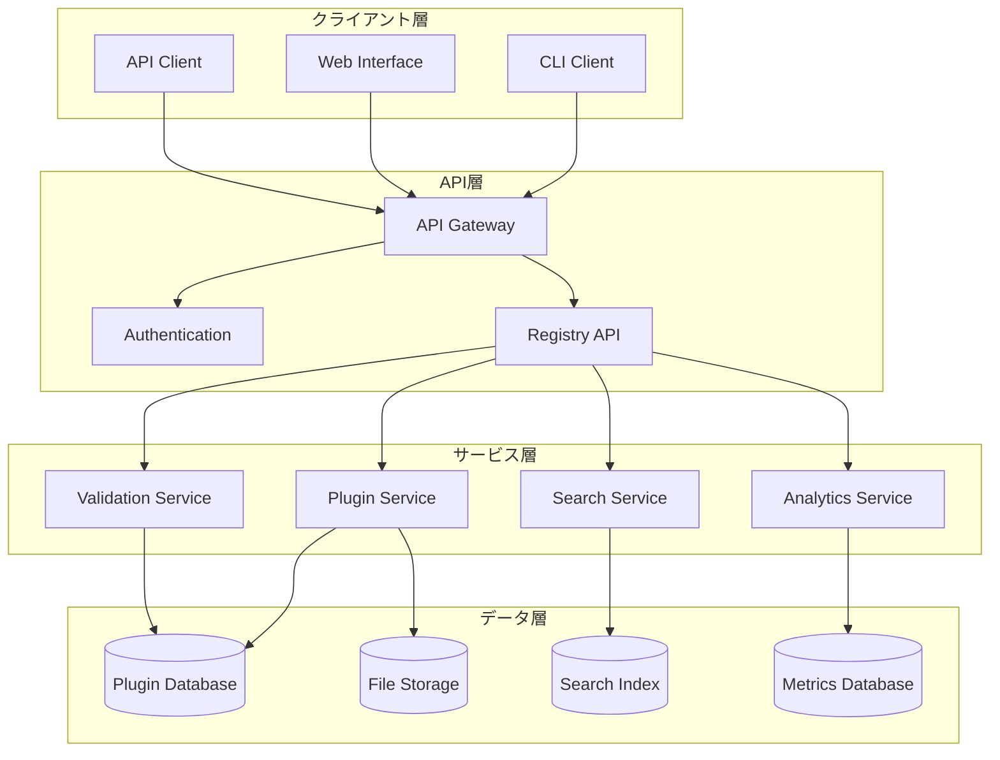

# プラグインレジストリ設計

AI Driven Dev Starter Kit のプラグインエコシステムの中核となるプラグインレジストリの設計仕様です。

## 概要

プラグインレジストリは、プラグインの配布、発見、管理を行う中央システムです。開発者がプラグインを簡単に共有し、ユーザーが必要な機能を見つけて利用できる環境を提供します。

## アーキテクチャ

### システム構成



## データモデル

### プラグインメタデータ

```typescript
interface RegistryPlugin {
  // 基本情報
  id: string;
  name: string;
  version: string;
  description: string;
  author: PluginAuthor;
  license: string;
  
  // 分類・タグ
  category: PluginCategory;
  tags: string[];
  keywords: string[];
  
  // 技術情報
  supportedKitVersions: string[];
  dependencies: PluginDependency[];
  platforms: Platform[];
  
  // 配布情報
  downloadUrl: string;
  checksums: PluginChecksums;
  packageSize: number;
  
  // メタデータ
  publishedAt: string;
  updatedAt: string;
  downloads: DownloadStats;
  rating: RatingStats;
  
  // 品質情報
  certification: PluginCertification;
  securityScan: SecurityScanResult;
  compatibility: CompatibilityInfo;
  
  // リポジトリ情報
  repository?: RepositoryInfo;
  documentation?: DocumentationInfo;
  
  // ステータス
  status: PluginStatus;
  deprecated?: DeprecationInfo;
}

interface PluginAuthor {
  name: string;
  email?: string;
  url?: string;
  organization?: string;
}

interface PluginDependency {
  pluginId: string;
  versionRange: string;
  optional: boolean;
}

interface PluginChecksums {
  sha256: string;
  md5: string;
}

interface DownloadStats {
  total: number;
  lastMonth: number;
  lastWeek: number;
  trending: boolean;
}

interface RatingStats {
  average: number;
  count: number;
  distribution: Record<string, number>; // "5": 10, "4": 5, etc.
}

type PluginStatus = 'active' | 'deprecated' | 'archived' | 'suspended';
type PluginCategory = 'web' | 'mobile' | 'api' | 'cli' | 'tool' | 'framework' | 'utility';
type Platform = 'windows' | 'macos' | 'linux' | 'all';
```

### レジストリ設定

```typescript
interface RegistryConfig {
  // レジストリ情報
  registryUrl: string;
  apiVersion: string;
  
  // 認証設定
  authenticationRequired: boolean;
  allowedProviders: AuthProvider[];
  
  // プラグイン制限
  maxPluginSize: number; // bytes
  allowedFileTypes: string[];
  maxDependencies: number;
  
  // 品質基準
  minimumCertificationLevel: QualityLevel;
  requiresSecurityScan: boolean;
  compatibilityTestRequired: boolean;
  
  // レート制限
  rateLimits: RateLimitConfig;
}

interface AuthProvider {
  name: 'github' | 'gitlab' | 'email' | 'oauth';
  enabled: boolean;
  config: Record<string, any>;
}

interface RateLimitConfig {
  publishPerDay: number;
  downloadPerHour: number;
  searchPerMinute: number;
}
```

## API仕様

### プラグイン管理API

#### プラグイン公開

```http
POST /api/v1/plugins
Authorization: Bearer <token>
Content-Type: multipart/form-data

{
  "metadata": { /* PluginMetadata */ },
  "package": <plugin-package-file>,
  "documentation": <docs-file>
}
```

**Response:**
```json
{
  "success": true,
  "pluginId": "your-plugin-name",
  "version": "1.0.0",
  "status": "pending_review",
  "validationResults": {
    "score": 85,
    "issues": [],
    "recommendations": []
  }
}
```

#### プラグイン検索

```http
GET /api/v1/plugins/search?q=<query>&category=<category>&tags=<tags>&page=<page>&limit=<limit>
```

**Response:**
```json
{
  "plugins": [
    {
      "id": "plugin-id",
      "name": "Plugin Name",
      "description": "Plugin description",
      "version": "1.0.0",
      "author": { "name": "Author Name" },
      "category": "web",
      "tags": ["react", "typescript"],
      "downloads": { "total": 1000 },
      "rating": { "average": 4.5, "count": 20 },
      "certification": { "level": "excellent" }
    }
  ],
  "pagination": {
    "page": 1,
    "limit": 20,
    "total": 150,
    "pages": 8
  }
}
```

#### プラグイン詳細取得

```http
GET /api/v1/plugins/{pluginId}
```

#### プラグインダウンロード

```http
GET /api/v1/plugins/{pluginId}/download/{version}
```

#### プラグイン評価

```http
POST /api/v1/plugins/{pluginId}/rating
Authorization: Bearer <token>

{
  "rating": 5,
  "review": "Excellent plugin! Very useful for our projects.",
  "pros": ["Easy to use", "Great documentation"],
  "cons": ["Could be faster"]
}
```

### 開発者API

#### 自分のプラグイン一覧

```http
GET /api/v1/developer/plugins
Authorization: Bearer <token>
```

#### プラグイン統計

```http
GET /api/v1/developer/plugins/{pluginId}/analytics
Authorization: Bearer <token>
```

**Response:**
```json
{
  "downloads": {
    "total": 5000,
    "lastMonth": 800,
    "lastWeek": 150,
    "daily": [/* daily download counts */]
  },
  "ratings": {
    "average": 4.3,
    "count": 45,
    "distribution": { "5": 20, "4": 15, "3": 8, "2": 1, "1": 1 }
  },
  "usage": {
    "activeInstallations": 1200,
    "countries": [/* usage by country */],
    "versions": [/* version distribution */]
  }
}
```

## CLI統合

### プラグイン管理コマンド

```bash
# プラグイン検索
npx ai-dev-kit plugin search "react native"
npx ai-dev-kit plugin search --category=mobile --tags=typescript

# プラグイン詳細表示
npx ai-dev-kit plugin info mobile-react-native

# プラグインインストール
npx ai-dev-kit plugin install mobile-react-native
npx ai-dev-kit plugin install mobile-react-native@1.2.0

# インストール済みプラグイン一覧
npx ai-dev-kit plugin list
npx ai-dev-kit plugin list --updates

# プラグイン更新
npx ai-dev-kit plugin update mobile-react-native
npx ai-dev-kit plugin update --all

# プラグインアンインストール
npx ai-dev-kit plugin uninstall mobile-react-native

# プラグイン公開（開発者向け）
npx ai-dev-kit plugin publish
npx ai-dev-kit plugin publish --token=<api-token>

# プラグイン検証
npx ai-dev-kit plugin validate ./my-plugin/
```

### 設定ファイル

```json
// ~/.ai-dev-kit/config.json
{
  "registry": {
    "url": "https://registry.ai-driven-dev.com",
    "token": "<your-api-token>",
    "autoUpdate": true,
    "trustedPublishers": ["ai-driven-dev", "verified-org"]
  },
  "plugins": {
    "installPath": "~/.ai-dev-kit/plugins",
    "allowPrerelease": false,
    "maxCacheSize": "500MB",
    "updateCheckInterval": "24h"
  }
}
```

## セキュリティとガバナンス

### セキュリティ対策

1. **コード検証**
   - 静的コード解析
   - 依存関係脆弱性スキャン
   - マルウェア検出

2. **パッケージ整合性**
   - チェックサム検証
   - デジタル署名
   - タンパリング検出

3. **アクセス制御**
   - API認証・認可
   - レート制限
   - 不正アクセス検出

4. **プライバシー保護**
   - ユーザーデータ最小化
   - 匿名化統計
   - GDPR準拠

### ガバナンス

1. **品質基準**
   - 最低品質スコア要件
   - ドキュメント必須化
   - テスト要求

2. **レビュープロセス**
   - 自動検証
   - ピアレビュー
   - セキュリティ監査

3. **ライセンス管理**
   - 許可されたライセンス
   - ライセンス互換性チェック
   - 著作権検証

4. **コミュニティ管理**
   - 行動規範
   - 報告・エスカレーション
   - 制裁措置

## 実装フェーズ

### Phase 1: 基本インフラ（4週間）
- [ ] データベーススキーマ設計・構築
- [ ] 基本API実装
- [ ] ファイルストレージ設定
- [ ] 認証システム実装

### Phase 2: コア機能（6週間）
- [ ] プラグイン公開・管理機能
- [ ] 検索・発見機能
- [ ] ダウンロード・インストール機能
- [ ] CLI統合

### Phase 3: 品質・セキュリティ（4週間）
- [ ] 自動検証システム
- [ ] セキュリティスキャン
- [ ] 品質認証システム
- [ ] レビュープロセス

### Phase 4: 分析・最適化（3週間）
- [ ] 分析ダッシュボード
- [ ] パフォーマンス監視
- [ ] 推奨システム
- [ ] A/Bテストフレームワーク

### Phase 5: コミュニティ機能（3週間）
- [ ] 評価・レビューシステム
- [ ] コミュニティフォーラム
- [ ] ドキュメントサイト
- [ ] 開発者ツール

## 運用考慮事項

### スケーラビリティ

1. **水平スケーリング**
   - マイクロサービスアーキテクチャ
   - ロードバランシング
   - CDN活用

2. **データ管理**
   - データベースシャーディング
   - レプリケーション
   - バックアップ戦略

3. **キャッシュ戦略**
   - Redis活用
   - エッジキャッシュ
   - アプリケーションレベルキャッシュ

### 監視・観測

1. **メトリクス**
   - APM (Application Performance Monitoring)
   - インフラメトリクス
   - ビジネスメトリクス

2. **ログ管理**
   - 構造化ログ
   - ログ集約
   - セキュリティログ

3. **アラート**
   - SLA監視
   - 異常検知
   - エスカレーション

### コスト最適化

1. **リソース効率化**
   - 自動スケーリング
   - スポットインスタンス活用
   - ストレージティアリング

2. **トラフィック最適化**
   - CDN活用
   - 画像最適化
   - 圧縮

## まとめ

プラグインレジストリは、AI Driven Dev Starter Kit エコシステムの成長と拡張を支える重要なインフラストラクチャです。

### 期待される効果

1. **開発者エクスペリエンス向上**
   - プラグインの簡単な発見・インストール
   - 品質保証されたプラグイン
   - 包括的なドキュメント

2. **エコシステム拡大**
   - コミュニティ貢献の促進
   - 高品質プラグインの蓄積
   - ベストプラクティスの共有

3. **品質向上**
   - 自動検証による品質保証
   - セキュリティ強化
   - 継続的な改善

このレジストリ設計により、開発者が安心してプラグインを共有・利用できる信頼性の高いプラットフォームを構築できます。